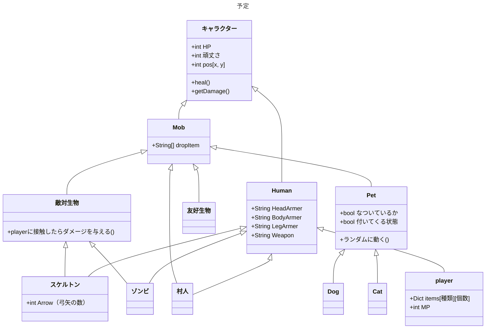

# percentateruun


```mermaid
---
title: 予定
---
classDiagram
    キャラクター <|-- Mob
    キャラクター <|-- Human
    敵対生物 <|-- スケルトン
    敵対生物 <|-- ゾンビ
    Mob <|-- 友好生物
    Mob <|-- 敵対生物
    Mob <|-- 村人
    Mob <|-- Pet
    Human <|-- player
    Human <|-- 村人
    Human <|-- ゾンビ
    Human <|-- スケルトン
    Pet <|-- Dog
    Pet <|-- Cat

    class キャラクター{
        +int HP
        +int 頑丈さ
        +int pos[x, y]
        +heal()
        +getDamage()
    }
    class Mob{
        +String[] dropItem
    }

    class 敵対生物{
        +playerに接触したらダメージを与える()
    }

    class player{
        +Dict items[種類][個数]
        +int MP
    }

    class Pet{
        +bool なついているか
        +bool 付いてくる状態
        +ランダムに動く()
    }

    class Human{
        +String HeadArmer
        +String BodyArmer
        +String LegArmer
        +String Weapon
    }

    class スケルトン{
        +int Arrow（弓矢の数）
    }

```

```mermaid

```
